# CLAUDE.md

This file provides guidance to Claude Code (claude.ai/code) when working with code in this repository.

## Project Overview

**Design Pages** is a modern digital design portfolio featuring a **full-screen infinite scrolling gallery** that showcases interactive CSS/JavaScript design experiments. The project has evolved from a traditional grid gallery to an immersive, GSAP-powered infinite scroll experience.

### Key Stats

- **16 design experiments** across 4 categories
- **7 featured works** highlighted in the gallery
- **4 horizontal scroll rows** with seamless infinite looping
- **Zero build process** — pure HTML, CSS, and JavaScript (with GSAP)

**Live Site:** https://chanmeng666.github.io/design-pages

---

## Architecture Overview

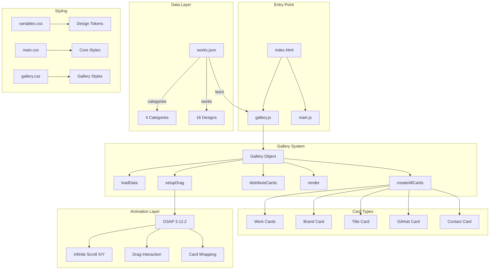

---

## Gallery System Architecture

The gallery is the core feature of this project. It implements a **full-screen infinite scrolling experience** with 4 horizontal rows of cards.

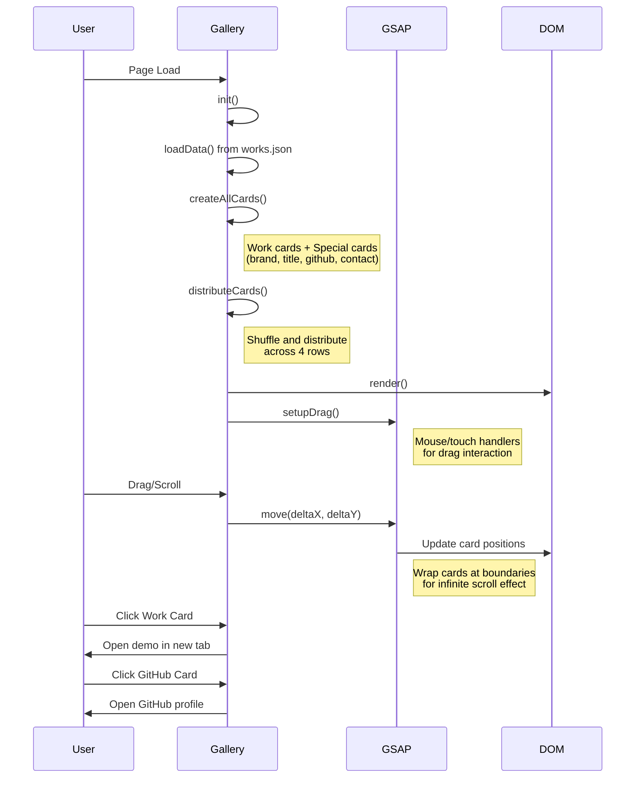

### Gallery Object Structure

```javascript
const Gallery = {
    container: null,      // .gallery-container element
    rows: [[], [], [], []], // 4 rows of card data
    allCards: [],         // Pool of all cards (works + special)
    cardData: [],         // GSAP animation tracking per card

    // Core methods
    init(),               // Main initialization
    loadData(),           // Fetch works.json
    createAllCards(),     // Generate card pool
    distributeCards(),    // Shuffle into 4 rows
    render(),             // DOM rendering
    setupDrag(),          // GSAP drag handlers
    move(x, y),           // Calculate drag movement with wrapping
    resize(),             // Handle window resize

    // Card renderers
    renderWorkCard(work),
    renderBrandCard(data),
    renderTitleCard(data),
    renderGithubCard(data),
    renderContactCard(data)
};
```

### Infinite Scroll Logic

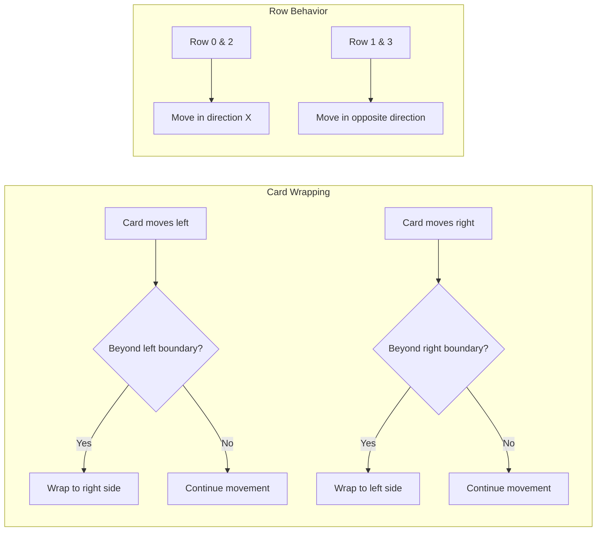

---

## Data Structure

### works.json Schema

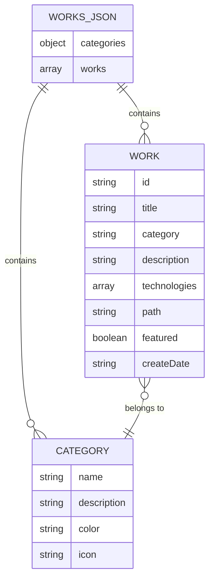

### Category Definitions

| Category Slug | Name | Color | Icon |
|---------------|------|-------|------|
| `3d-effects` | 3D Effects | #007BEF | cube |
| `experimental` | Experimental | #FED700 | flask |
| `geometric-designs` | Geometric Designs | #16ABFA | shapes |
| `gradient-effects` | Gradient Effects | #F7F08A | gradient |

### Work Entry Structure

```json
{
  "id": "unique-slug",
  "title": "Display Name",
  "category": "category-slug",
  "description": "Brief description",
  "technologies": ["CSS 3D", "JavaScript"],
  "path": "demos/category/filename.html",
  "featured": true,
  "createDate": "2024-01-15"
}
```

---

## CSS Architecture

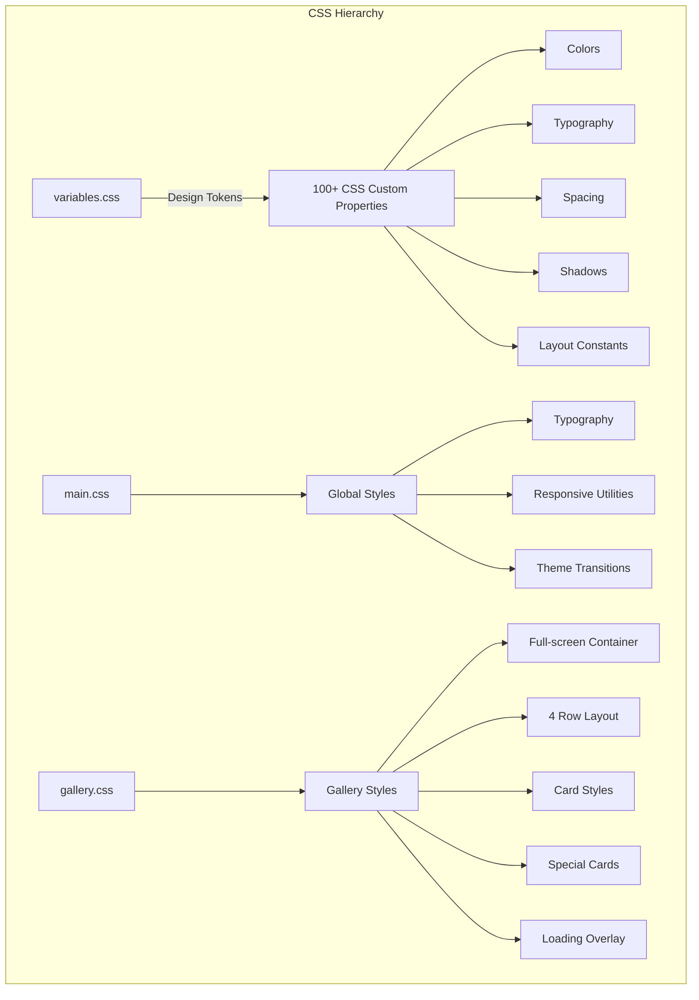

### Key CSS Variables

```css
/* Brand Colors */
--brand-yellow: #FED700;
--brand-blue: #007BEF;
--brand-sky: #16ABFA;
--brand-pale: #F7F08A;

/* Gallery Constants */
--card-width: 350px;
--card-height: 280px;
--row-height: 280em;
--card-gap: 2rem;

/* Typography */
--font-primary: 'DM Sans', sans-serif;
--font-display: 'Bebas Neue', sans-serif;
--font-mono: 'JetBrains Mono', monospace;
```

---

## JavaScript Organization

### File Structure

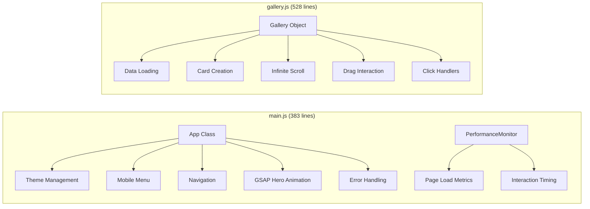

### App Class (main.js)

```javascript
class App {
    constructor()           // Initialize application
    setupEventListeners()   // Theme, menu, navigation
    setupTheme()            // Load saved theme from localStorage
    toggleTheme()           // Switch light/dark mode
    setTheme(theme)         // Apply theme class, dispatch event
    setupNavigation()       // Active nav highlighting
    updateMobileMenuIcon()  // Mobile menu state
    setupAnimations()       // GSAP hero timeline + fallback
}
```

### Hero Animation Timeline

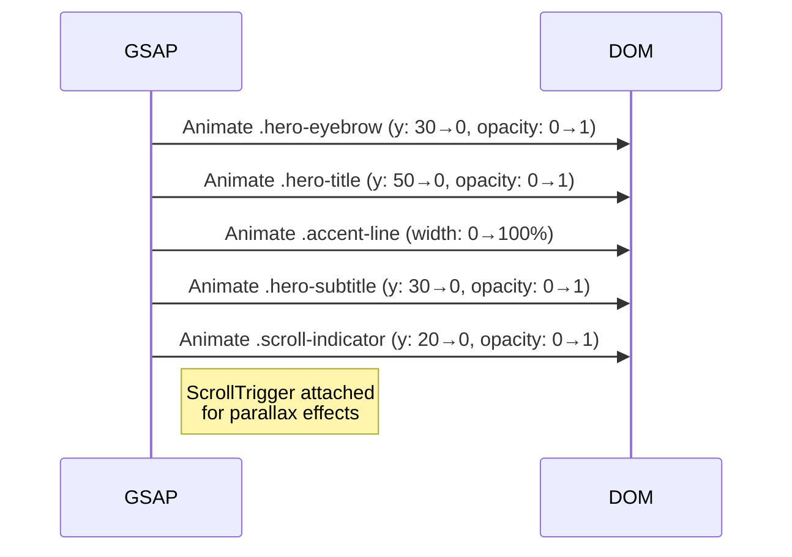

---

## File Structure

```
design-pages/
├── index.html                          # Main portfolio page (minimal HTML)
├── CLAUDE.md                           # Claude Code guidance (this file)
├── README.md                           # Project documentation
├── LICENSE                             # MIT License
│
├── assets/
│   ├── css/
│   │   ├── variables.css              # Design tokens (100+ CSS custom properties)
│   │   ├── main.css                   # Core styles & components
│   │   └── gallery.css                # Gallery-specific styles
│   ├── js/
│   │   ├── main.js                    # App class (383 lines)
│   │   └── gallery.js                 # Gallery object (528 lines)
│   └── images/
│       ├── design-pages-logo.svg      # Brand logo
│       ├── gallery-overview.png       # Screenshots
│       └── screenshots/               # Additional screenshots
│
├── data/
│   └── works.json                     # Portfolio data (16 works, 4 categories)
│
└── demos/                             # Design experiment HTML files
    ├── 3d-effects/                    # 4 demos
    │   ├── rotating-cube.html         # ⭐ Featured
    │   ├── isometric-cube.html
    │   ├── spatial-rhythm.html
    │   └── floating-rings.html
    │
    ├── experimental/                  # 4 demos
    │   ├── visual-rhythm.html         # ⭐ Featured
    │   ├── composition-study.html
    │   ├── dancing-cat-in-flowers.html # ⭐ Featured (Canvas API)
    │   └── horizontal-scroll-ticker.html # ⭐ Featured (GSAP ScrollTrigger)
    │
    ├── geometric-designs/             # 3 demos
    │   ├── static-rectangles.html     # ⭐ Featured
    │   ├── perspective-bars.html      # ⭐ Featured
    │   └── animated-rectangles.html
    │
    └── gradient-effects/              # 5 demos
        ├── symmetrical-conic.html
        ├── dynamic-poster.html
        ├── conic-gradient.html        # ⭐ Featured
        ├── svg-gradient-v2.html
        └── svg-gradient.html
```

---

## Technology Stack

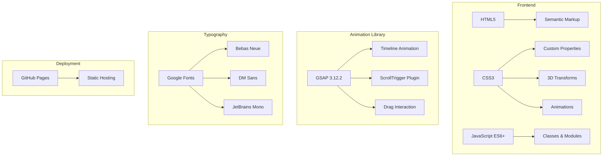

| Layer | Technology | Purpose |
|-------|-----------|---------|
| **Markup** | HTML5 | Semantic structure |
| **Styling** | CSS3 + Custom Properties | Design system, themes |
| **Logic** | Vanilla JavaScript ES6+ | Interactivity |
| **Animation** | GSAP 3.12.2 | Infinite scroll, hero animation |
| **Fonts** | Google Fonts | Typography |
| **Hosting** | GitHub Pages | Static deployment |

---

## Development Commands

### Running Locally

```bash
# Python (recommended)
python -m http.server 8000

# Node.js
npx serve .

# PHP
php -S localhost:8000

# Then open: http://localhost:8000
```

### Viewing Individual Demos

```bash
# Open any demo directly in browser
start demos/3d-effects/rotating-cube.html

# Or via local server
http://localhost:8000/demos/3d-effects/rotating-cube.html
```

---

## Adding New Design Experiments

### Step-by-Step Workflow

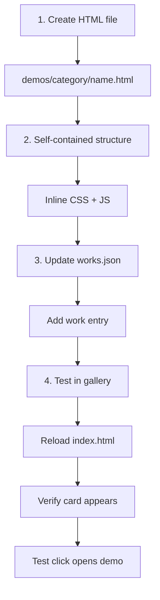

### HTML Template

```html
<!DOCTYPE html>
<html lang="en">
<head>
    <meta charset="UTF-8">
    <meta name="viewport" content="width=device-width, initial-scale=1.0">
    <title>Design Name</title>
    <style>
        * { margin: 0; padding: 0; box-sizing: border-box; }
        body {
            min-height: 100vh;
            display: flex;
            align-items: center;
            justify-content: center;
            background: #0a0a0a;
        }
        /* Your design styles */
    </style>
</head>
<body>
    <!-- Your design markup -->
    <script>
        // Your interactive JavaScript
    </script>
</body>
</html>
```

### works.json Entry

```json
{
  "id": "your-design-id",
  "title": "Your Design Title",
  "category": "experimental",
  "description": "Brief description of the design",
  "technologies": ["CSS Animation", "JavaScript"],
  "path": "demos/experimental/your-design.html",
  "featured": false,
  "createDate": "2025-01-01"
}
```

---

## Card Click Behavior

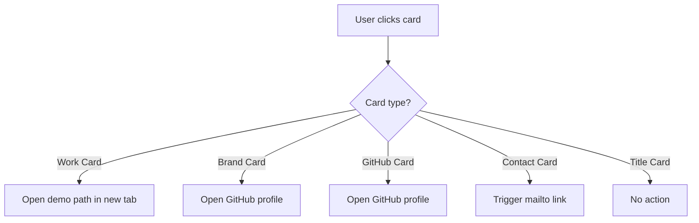

---

## Theme System

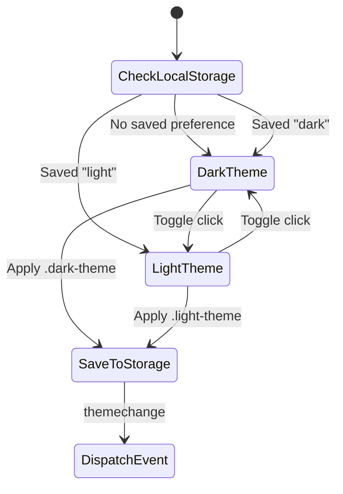

### Key Theme Variables

```css
/* Dark theme (default) */
body.dark-theme {
    --primary-bg: #0a0a0a;
    --text-primary: #ffffff;
    --card-bg: rgba(30, 30, 30, 0.8);
}

/* Light theme */
body.light-theme {
    --primary-bg: #f5f5f5;
    --text-primary: #1a1a1a;
    --card-bg: rgba(255, 255, 255, 0.9);
}
```

---

## Performance Optimizations

```mermaid
graph LR
    subgraph "Rendering"
        A[GPU Acceleration] --> B[transform/opacity only]
        C[Lazy Loading] --> D[loading="lazy" on iframes]
    end

    subgraph "Events"
        E[Passive Listeners] --> F[Touch events]
        G[RAF] --> H[Animation frames]
    end

    subgraph "Resources"
        I[No Build Step] --> J[Direct file serving]
        K[Single External Dep] --> L[GSAP CDN]
    end
```

| Technique | Implementation |
|-----------|---------------|
| **GPU Acceleration** | All animations use `transform` and `opacity` |
| **Lazy Loading** | Iframes have `loading="lazy"` attribute |
| **Passive Events** | Touch handlers use `{ passive: true }` |
| **Card Duplication** | Minimum 10 cards per row for seamless wrapping |
| **Drag Threshold** | 10px threshold prevents accidental clicks |

---

## Common Gotchas

### 1. Iframe Pointer Events
Gallery cards disable pointer events on iframes to allow card interaction:
```css
.work-card iframe { pointer-events: none; }
```

### 2. Card Duplication for Infinite Scroll
Each row needs minimum 10 cards for seamless wrapping. Cards are duplicated if necessary:
```javascript
while (row.length < 10) {
    row.push(...shuffled.slice(0, 10 - row.length));
}
```

### 3. Drag vs Click Detection
A 10px movement threshold distinguishes drags from clicks:
```javascript
const isDrag = Math.abs(deltaX) > 10 || Math.abs(deltaY) > 10;
```

### 4. Category Slug Matching
The `category` field in works must match a key in the `categories` object.

### 5. Special Card Types
Four special cards are automatically added:
- `brand` - Logo + name + tagline
- `title` - Portfolio title card
- `github` - GitHub profile link
- `contact` - Email mailto link

### 6. GSAP Dependency
Unlike the old version, this project now requires GSAP 3.12.2 loaded via CDN.

---

## Troubleshooting

### Gallery Not Loading
1. Check console for JSON fetch errors
2. Verify `data/works.json` is valid JSON
3. Ensure GSAP is loaded (check for `gsap` global)
4. Check for `.gallery-container` element in DOM

### Cards Not Infinite Scrolling
1. Verify enough cards exist (minimum 10 per row)
2. Check GSAP initialization in `setupDrag()`
3. Verify card width calculations in `resize()`

### Demo Not Appearing
1. Verify entry exists in `data/works.json`
2. Check `category` matches a valid category slug
3. Verify `path` is correct relative to project root

### Click Not Working
1. Check if drag threshold is being triggered accidentally
2. Verify click handler is attached in `setupCardClicks()`
3. Check console for JavaScript errors

### Theme Not Persisting
1. Check if localStorage is enabled
2. Verify `App.setTheme()` is saving correctly
3. Check for JS errors preventing theme code execution

---

## Recent Major Changes

### Full-Screen Infinite Scroll Gallery (Latest)
- Replaced traditional grid/list view with 4-row infinite scroll
- Added GSAP-powered drag interaction
- Implemented card wrapping for seamless looping
- Added special cards (brand, title, github, contact)

### GSAP Integration
- Hero section now uses GSAP timeline animation
- ScrollTrigger for parallax effects
- Gallery uses GSAP for smooth card positioning

### New Demos
- **Dancing Cat in Flowers** - Canvas API animation (Oct 2025)
- **Horizontal Scroll Ticker** - GSAP ScrollTrigger demo (Dec 2025)

### Special Cards
- Brand card with logo and tagline
- Title card for portfolio branding
- GitHub card linking to profile
- Contact card with mailto link

---

## Quick Reference

| What | Where |
|------|-------|
| Add new design | `demos/{category}/` + `data/works.json` |
| Modify gallery behavior | `assets/js/gallery.js` |
| Change theme colors | `assets/css/variables.css` |
| Update card styles | `assets/css/gallery.css` |
| Modify hero animation | `assets/js/main.js` → `setupAnimations()` |
| Category definitions | `data/works.json` → `categories` |
| Special card content | `assets/js/gallery.js` → `createAllCards()` |
