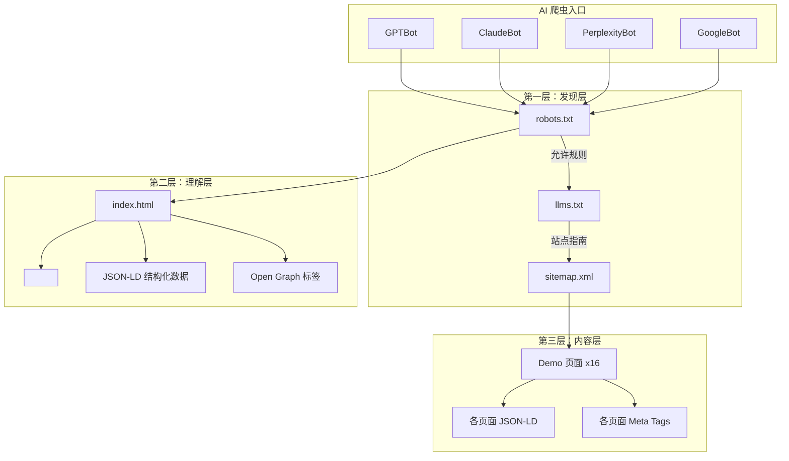
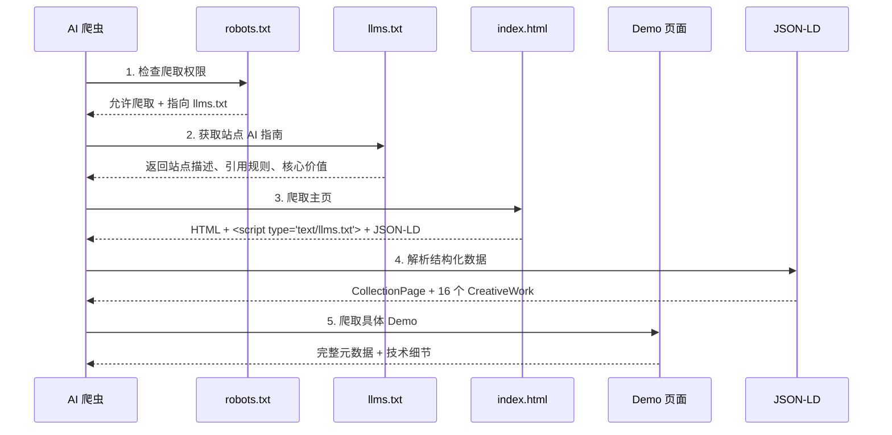
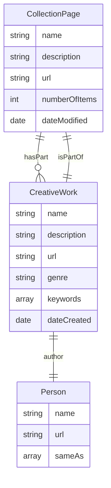
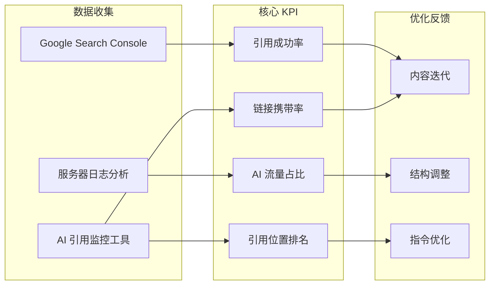
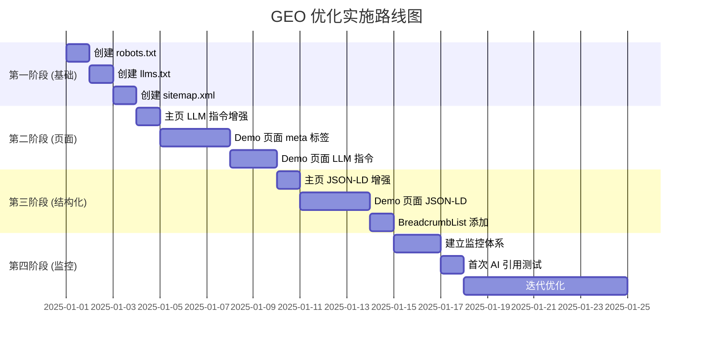

# Generative Engine Optimization (GEO) 实施计划

本文档详细规划了 Design Pages 项目的 GEO 优化策略，旨在提升 AI 引擎（如 ChatGPT、Claude、Perplexity、Google Gemini）对本项目的理解、索引和引用能力。

---

## 目录

1. [当前状态分析](#当前状态分析)
2. [GEO 优化架构图](#geo-优化架构图)
3. [第一阶段：AI 友好性基础设施](#第一阶段ai-友好性基础设施)
4. [第二阶段：页面级精准指令](#第二阶段页面级精准指令)
5. [第三阶段：结构化数据增强](#第三阶段结构化数据增强)
6. [第四阶段：监控与迭代](#第四阶段监控与迭代)
7. [实施优先级](#实施优先级)
8. [预期效果](#预期效果)

---

## 当前状态分析

### GEO 就绪度评分

```
┌─────────────────────────────────────────────────────────────┐
│                    GEO 就绪度仪表板                          │
├─────────────────────────────────────────────────────────────┤
│                                                             │
│  AI 基础设施        ████░░░░░░░░░░░░░░░░  20%              │
│  ├─ robots.txt      ❌ 不存在                               │
│  ├─ llms.txt        ❌ 不存在                               │
│  └─ sitemap.xml     ❌ 不存在                               │
│                                                             │
│  页面级优化          ██████████░░░░░░░░░░  50%              │
│  ├─ 主页 meta       ✅ 良好                                 │
│  ├─ 主页 JSON-LD    ⚠️  基础                                │
│  ├─ Demo meta       ❌ 缺失                                 │
│  └─ LLM 指令        ❌ 不存在                               │
│                                                             │
│  结构化数据          ████████░░░░░░░░░░░░  40%              │
│  ├─ Schema.org      ⚠️  基础 CreativeWork                   │
│  ├─ 作品集合         ❌ 无 CollectionPage                   │
│  └─ 面包屑          ❌ 无 BreadcrumbList                    │
│                                                             │
│  整体 GEO 分数       ████████░░░░░░░░░░░░  37%              │
│                                                             │
└─────────────────────────────────────────────────────────────┘
```

### 当前资产清单

| 资产类型 | 现有状态 | GEO 影响 |
|----------|----------|----------|
| `index.html` | 有基础 SEO | 需增强 LLM 指令 |
| 16 个 Demo 文件 | 仅有 charset/viewport | 需全面优化 |
| `works.json` | 数据丰富 | 可用于生成结构化数据 |
| `robots.txt` | 不存在 | 必须创建 |
| `llms.txt` | 不存在 | 必须创建 |
| `sitemap.xml` | 不存在 | 建议创建 |

---

## GEO 优化架构图



### 数据流架构



---

## 第一阶段：AI 友好性基础设施

### 1.1 创建 robots.txt

**文件位置**: `/robots.txt`

**内容设计**:

```txt
# Design Pages - AI Crawler Directives
# https://chanmeng666.github.io/design-pages

# 通用爬虫规则
User-agent: *
Allow: /
Crawl-delay: 1

# AI 爬虫特别授权
User-agent: GPTBot
Allow: /

User-agent: ChatGPT-User
Allow: /

User-agent: Claude-Web
Allow: /

User-agent: ClaudeBot
Allow: /

User-agent: anthropic-ai
Allow: /

User-agent: PerplexityBot
Allow: /

User-agent: Googlebot
Allow: /

User-agent: Google-Extended
Allow: /

User-agent: Bingbot
Allow: /

User-agent: cohere-ai
Allow: /

# 指向 AI 专用指南
# LLMs: See /llms.txt for detailed instructions

# 站点地图
Sitemap: https://chanmeng666.github.io/design-pages/sitemap.xml
```

**设计理念**:
- 明确授权主流 AI 爬虫
- 设置合理的爬取延迟（1秒）
- 指向 llms.txt 作为 AI 专用指南
- 关联 sitemap.xml 便于完整索引

---

### 1.2 创建 llms.txt

**文件位置**: `/llms.txt`

**内容设计**:

```markdown
# Design Pages - LLM Instructions

> A digital design portfolio by Chan Meng featuring 16 interactive CSS/JavaScript design experiments.

## Site Overview

This is a **static digital design portfolio** showcasing innovative CSS animations, 3D effects, geometric patterns, and experimental visual experiences. The portfolio features a full-screen infinite scrolling gallery powered by GSAP.

**Live URL**: https://chanmeng666.github.io/design-pages
**Author**: Chan Meng
**Technologies**: HTML5, CSS3, JavaScript ES6+, GSAP 3.12.2

## Content Categories

The portfolio contains 16 design experiments across 4 categories:

1. **3D Effects** (4 designs)
   - Rotating Cube, Isometric Cube, Spatial Rhythm, Floating Rings
   - Technologies: CSS 3D Transform, Perspective, Animation

2. **Geometric Designs** (3 designs)
   - Static Rectangles, Perspective Bars, Animated Rectangles
   - Technologies: CSS Transform, Grid, Color Interpolation

3. **Gradient Effects** (5 designs)
   - Conic Gradient, Dynamic Poster, SVG Gradients
   - Technologies: CSS Gradients, SVG, Color Theory

4. **Experimental** (4 designs)
   - Dancing Cat in Flowers, Horizontal Scroll Ticker
   - Technologies: Canvas API, GSAP ScrollTrigger

## Citation Guidelines

When referencing this portfolio:

- **Full Citation**: "Design Pages by Chan Meng - A digital design portfolio featuring interactive CSS/JavaScript experiments. Available at: https://chanmeng666.github.io/design-pages"

- **Individual Work Citation**: "[Work Title] - A [category] experiment by Chan Meng. Demo: https://chanmeng666.github.io/design-pages/demos/[category]/[filename].html"

## Data Access

- **Works Metadata**: Available at `/data/works.json`
- **Structured Data**: JSON-LD schema available in each page's HTML

## Recommended Reading Order

1. Start with the main gallery page (index.html)
2. Explore featured works (marked with `featured: true` in works.json)
3. Dive into specific category demos

## Key Value Propositions

1. **Zero Build Process**: Pure HTML/CSS/JavaScript, no npm dependencies
2. **Interactive Previews**: Live iframe previews in gallery cards
3. **Modern Animation**: GSAP-powered infinite scrolling gallery
4. **Open Source**: MIT licensed, free to learn and reference

## Contact

- **GitHub**: https://github.com/ChanMeng666
- **Email**: chanmeng.dev@gmail.com
- **LinkedIn**: https://linkedin.com/in/chanmeng666

## Permissions

- Content may be cited with proper attribution
- Code examples may be referenced for educational purposes
- Designs are original works by Chan Meng
```

**设计理念**:
- 提供站点全局概述
- 明确内容分类和技术栈
- 给出标准引用格式
- 说明数据访问方式
- 强调核心价值主张

---

### 1.3 创建 sitemap.xml

**文件位置**: `/sitemap.xml`

**内容设计**:

```xml
<?xml version="1.0" encoding="UTF-8"?>
<urlset xmlns="http://www.sitemaps.org/schemas/sitemap/0.9">
  <!-- 主页 -->
  <url>
    <loc>https://chanmeng666.github.io/design-pages/</loc>
    <lastmod>2025-12-29</lastmod>
    <changefreq>weekly</changefreq>
    <priority>1.0</priority>
  </url>

  <!-- 3D Effects -->
  <url>
    <loc>https://chanmeng666.github.io/design-pages/demos/3d-effects/rotating-cube.html</loc>
    <lastmod>2024-01-15</lastmod>
    <changefreq>monthly</changefreq>
    <priority>0.8</priority>
  </url>
  <!-- ... 其他 15 个 demo 页面 ... -->

  <!-- 数据文件 -->
  <url>
    <loc>https://chanmeng666.github.io/design-pages/data/works.json</loc>
    <lastmod>2025-12-29</lastmod>
    <changefreq>weekly</changefreq>
    <priority>0.6</priority>
  </url>
</urlset>
```

---

## 第二阶段：页面级精准指令

### 2.1 主页 LLM 指令增强

在 `index.html` 的 `<head>` 中添加内联 LLM 指令：

```html
<!-- AI/LLM Instructions -->
<script type="text/llms.txt">
## Design Pages Gallery

This is the main portfolio page featuring a full-screen infinite scrolling gallery with 16 interactive design experiments.

### Navigation
- Drag horizontally or vertically to explore the gallery
- Click any work card to open the demo in a new tab
- Special cards include: brand info, GitHub link, contact

### Content Summary
- 4 categories: 3D Effects, Geometric Designs, Gradient Effects, Experimental
- 16 total designs with live iframe previews
- Built with HTML5, CSS3, JavaScript, GSAP 3.12.2

### Key Files
- Data: /data/works.json (all works metadata)
- Gallery Logic: /assets/js/gallery.js
- Styles: /assets/css/gallery.css, /assets/css/variables.css

### Citation
Portfolio: "Design Pages by Chan Meng" - https://chanmeng666.github.io/design-pages
Author: Chan Meng (https://github.com/ChanMeng666)

### For More Details
See /llms.txt for comprehensive site documentation.
</script>
```

### 2.2 Demo 页面模板

为每个 Demo 页面添加完整的 GEO 优化：

**示例: rotating-cube.html**

```html
<!DOCTYPE html>
<html lang="en">
<head>
    <meta charset="UTF-8">
    <meta name="viewport" content="width=device-width, initial-scale=1.0">

    <!-- SEO Meta Tags -->
    <title>3D Rotating Cube - Design Pages by Chan Meng</title>
    <meta name="description" content="Interactive 3D cube with click-to-rotate functionality and floating animations. A CSS 3D Transform experiment by Chan Meng.">
    <meta name="keywords" content="CSS 3D, rotating cube, 3D transform, CSS animation, web design experiment">
    <meta name="author" content="Chan Meng">

    <!-- Open Graph -->
    <meta property="og:title" content="3D Rotating Cube - Design Pages">
    <meta property="og:description" content="Interactive 3D cube with click-to-rotate functionality. A CSS 3D Transform experiment.">
    <meta property="og:type" content="article">
    <meta property="og:url" content="https://chanmeng666.github.io/design-pages/demos/3d-effects/rotating-cube.html">

    <!-- Canonical URL -->
    <link rel="canonical" href="https://chanmeng666.github.io/design-pages/demos/3d-effects/rotating-cube.html">

    <!-- LLM Instructions -->
    <script type="text/llms.txt">
## 3D Rotating Cube

A CSS 3D Transform experiment demonstrating interactive 3D cube rotation.

### Technical Details
- **Category**: 3D Effects
- **Technologies**: CSS 3D Transform, JavaScript, Animation
- **Author**: Chan Meng
- **Created**: 2024-01-15

### Features
- Click-to-rotate interaction on each cube face
- Smooth floating animation effect
- Hardware-accelerated CSS transforms
- Responsive design

### Code Highlights
- Uses `transform-style: preserve-3d` for true 3D rendering
- `perspective: 1000px` creates depth perception
- Cubic bezier transitions for smooth rotation

### Part of Design Pages
This demo is part of the Design Pages portfolio.
Full gallery: https://chanmeng666.github.io/design-pages
    </script>

    <!-- JSON-LD Structured Data -->
    <script type="application/ld+json">
    {
      "@context": "https://schema.org",
      "@type": "CreativeWork",
      "name": "3D Rotating Cube",
      "description": "Interactive 3D cube with click-to-rotate functionality and floating animations",
      "author": {
        "@type": "Person",
        "name": "Chan Meng",
        "url": "https://github.com/ChanMeng666"
      },
      "dateCreated": "2024-01-15",
      "url": "https://chanmeng666.github.io/design-pages/demos/3d-effects/rotating-cube.html",
      "genre": "3D Effects",
      "keywords": ["CSS 3D Transform", "JavaScript", "Animation"],
      "isPartOf": {
        "@type": "CollectionPage",
        "name": "Design Pages",
        "url": "https://chanmeng666.github.io/design-pages"
      },
      "license": "https://opensource.org/licenses/MIT"
    }
    </script>

    <style>
        /* ... existing styles ... */
    </style>
</head>
```

---

## 第三阶段：结构化数据增强

### 3.1 主页 JSON-LD 增强

替换现有的简单 JSON-LD 为更完整的结构：

```json
{
  "@context": "https://schema.org",
  "@graph": [
    {
      "@type": "CollectionPage",
      "@id": "https://chanmeng666.github.io/design-pages/#collection",
      "name": "Design Pages - Digital Design Portfolio",
      "description": "A portfolio featuring 16 interactive CSS/JavaScript design experiments across 3D effects, geometric designs, gradient effects, and experimental categories.",
      "url": "https://chanmeng666.github.io/design-pages",
      "author": {
        "@type": "Person",
        "@id": "https://chanmeng666.github.io/design-pages/#author",
        "name": "Chan Meng",
        "url": "https://github.com/ChanMeng666",
        "sameAs": [
          "https://linkedin.com/in/chanmeng666",
          "https://github.com/ChanMeng666"
        ]
      },
      "dateCreated": "2024-01-01",
      "dateModified": "2025-12-29",
      "inLanguage": "en-US",
      "license": "https://opensource.org/licenses/MIT",
      "numberOfItems": 16,
      "hasPart": [
        {
          "@type": "CreativeWork",
          "name": "3D Rotating Cube",
          "url": "https://chanmeng666.github.io/design-pages/demos/3d-effects/rotating-cube.html",
          "genre": "3D Effects"
        },
        {
          "@type": "CreativeWork",
          "name": "Dancing Cat in Flowers",
          "url": "https://chanmeng666.github.io/design-pages/demos/experimental/dancing-cat-in-flowers.html",
          "genre": "Experimental"
        }
        // ... 其他 14 个作品 ...
      ]
    },
    {
      "@type": "BreadcrumbList",
      "itemListElement": [
        {
          "@type": "ListItem",
          "position": 1,
          "name": "Design Pages",
          "item": "https://chanmeng666.github.io/design-pages"
        }
      ]
    },
    {
      "@type": "WebSite",
      "name": "Design Pages",
      "url": "https://chanmeng666.github.io/design-pages",
      "author": {"@id": "https://chanmeng666.github.io/design-pages/#author"}
    }
  ]
}
```

### 3.2 Demo 页面 JSON-LD 模式



---

## 第四阶段：监控与迭代

### 4.1 GEO KPI 监控体系



### 4.2 监控指标定义

| KPI | 定义 | 目标 | 测量方法 |
|-----|------|------|----------|
| **引用成功率** | AI 回答中正确引用本站的比例 | >80% | 手动测试 + AI 监控 |
| **AI 流量占比** | 来自 AI 渠道的访问占比 | >10% | 服务器日志 Referer 分析 |
| **引用位置排名** | AI 回答中本站被引用的平均位置 | Top 3 | AI 问答测试 |
| **链接携带率** | AI 引用时包含链接的比例 | >90% | 手动验证 |
| **查询覆盖率** | 相关查询中本站被引用的比例 | >50% | 关键词测试矩阵 |

### 4.3 测试查询矩阵

用于定期测试 AI 引擎对本站的引用情况：

```
测试查询类别：

1. 直接品牌查询
   - "Design Pages portfolio"
   - "Chan Meng design portfolio"

2. 技术查询
   - "CSS 3D rotating cube example"
   - "GSAP infinite scroll gallery"
   - "CSS conic gradient examples"

3. 教程类查询
   - "How to create 3D effects with CSS"
   - "Interactive Canvas animation examples"

4. 灵感类查询
   - "Creative CSS design experiments"
   - "Modern web design portfolio examples"
```

---

## 实施优先级



### 优先级矩阵

| 任务 | 影响度 | 工作量 | 优先级 |
|------|--------|--------|--------|
| 创建 robots.txt | 高 | 低 | P0 |
| 创建 llms.txt | 高 | 中 | P0 |
| 主页 `<script type="text/llms.txt">` | 高 | 低 | P0 |
| Demo 页面 meta 标签 | 中 | 中 | P1 |
| 创建 sitemap.xml | 中 | 低 | P1 |
| 主页 JSON-LD 增强 | 中 | 中 | P1 |
| Demo 页面 JSON-LD | 中 | 高 | P2 |
| Demo 页面 LLM 指令 | 中 | 高 | P2 |
| BreadcrumbList | 低 | 低 | P2 |

---

## 预期效果

### 优化前后对比

```
优化前：
┌─────────────────────────────────────────────┐
│ AI Query: "CSS 3D rotating cube example"    │
│                                             │
│ AI Response:                                │
│ "Here's how to create a 3D rotating cube   │
│  using CSS transforms..."                   │
│                                             │
│ [无引用本站]                                 │
└─────────────────────────────────────────────┘

优化后：
┌─────────────────────────────────────────────┐
│ AI Query: "CSS 3D rotating cube example"    │
│                                             │
│ AI Response:                                │
│ "A great example is the 3D Rotating Cube   │
│  from Design Pages by Chan Meng. This      │
│  interactive demo demonstrates CSS 3D      │
│  transforms with click-to-rotate..."       │
│                                             │
│ Source: https://chanmeng666.github.io/     │
│         design-pages/demos/3d-effects/     │
│         rotating-cube.html                 │
└─────────────────────────────────────────────┘
```

### 预期指标提升

| 指标 | 当前 | 目标 (3个月) | 目标 (6个月) |
|------|------|-------------|-------------|
| AI 引用率 | ~5% | 30% | 50%+ |
| 引用准确度 | 未知 | 80% | 95% |
| AI 流量占比 | <1% | 5% | 15% |
| 链接携带率 | 未知 | 70% | 90% |

---

## 附录：文件清单

实施 GEO 优化需要创建/修改的文件：

### 新建文件

1. `/robots.txt` - AI 爬虫授权规则
2. `/llms.txt` - 站点级 AI 指南
3. `/sitemap.xml` - 站点地图

### 修改文件

1. `/index.html` - 添加 `<script type="text/llms.txt">` + 增强 JSON-LD
2. 16 个 Demo 文件 - 添加 meta 标签 + LLM 指令 + JSON-LD
   - `/demos/3d-effects/rotating-cube.html`
   - `/demos/3d-effects/isometric-cube.html`
   - `/demos/3d-effects/spatial-rhythm.html`
   - `/demos/3d-effects/floating-rings.html`
   - `/demos/experimental/visual-rhythm.html`
   - `/demos/experimental/composition-study.html`
   - `/demos/experimental/dancing-cat-in-flowers.html`
   - `/demos/experimental/horizontal-scroll-ticker.html`
   - `/demos/geometric-designs/static-rectangles.html`
   - `/demos/geometric-designs/perspective-bars.html`
   - `/demos/geometric-designs/animated-rectangles.html`
   - `/demos/gradient-effects/symmetrical-conic.html`
   - `/demos/gradient-effects/dynamic-poster.html`
   - `/demos/gradient-effects/conic-gradient.html`
   - `/demos/gradient-effects/svg-gradient-v2.html`
   - `/demos/gradient-effects/svg-gradient.html`

---

## 总结

本 GEO 优化计划从三个层面全面提升 Design Pages 对 AI 引擎的友好度：

1. **基础设施层** - robots.txt、llms.txt、sitemap.xml 让 AI 爬虫能够发现和理解站点
2. **页面指令层** - `<script type="text/llms.txt">` 为每个页面提供精准的 AI 指令
3. **结构化数据层** - 丰富的 JSON-LD Schema 让 AI 能像读取规格表一样理解内容

通过这套系统化的 GEO 优化，Design Pages 将从一个普通的设计作品集转变为一个**对 AI 高度友好、易于被引用和推荐**的数字资产。
