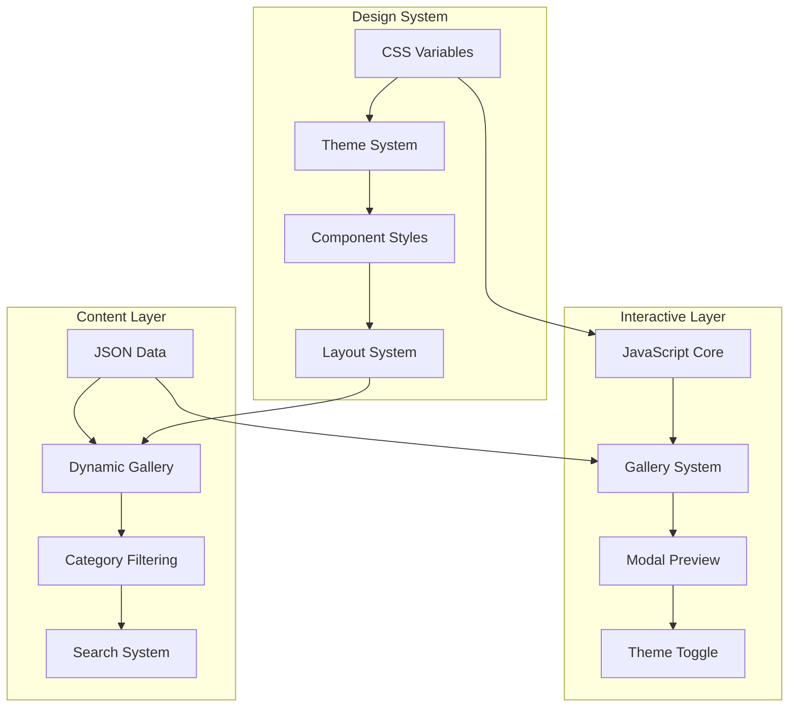

<div align="center"><a name="readme-top"></a>

# 🎨 Design Pages<br/><h3>Interactive Digital Design Portfolio & Visual Experiments</h3>

A cutting-edge digital design portfolio showcasing innovative CSS animations, 3D effects, geometric patterns, and experimental visual experiences.<br/>
Features interactive galleries, responsive design, and modern web technologies.<br/>
Explore the **FUTURE** of creative web development and visual storytelling.

[Live Demo][demo-link] · [Documentation][docs] · [View Gallery][gallery-link] · [Issues][github-issues-link]

<br/>

[][demo-link]

<br/>

<!-- SHIELD GROUP -->

[![][github-release-shield]][github-release-link]
[![][github-stars-shield]][github-stars-link]
[![][github-forks-shield]][github-forks-link]
[![][github-issues-shield]][github-issues-link]
[![][github-license-shield]][github-license-link]<br/>
[![][css3-shield]][css3-link]
[![][html5-shield]][html5-link]
[![][javascript-shield]][javascript-link]
[![][responsive-shield]][responsive-link]

**Share This Project**

[![][share-x-shield]][share-x-link]
[![][share-linkedin-shield]][share-linkedin-link]
[![][share-reddit-shield]][share-reddit-link]

<sup>🌟 Pushing the boundaries of web-based visual design. Built for designers, developers, and digital artists.</sup>

## 📸 Project Gallery

> [!TIP]
> Experience the full interactive gallery with live previews, search, and filtering capabilities.

<div align="center">
  
  <p><em>Interactive Gallery Dashboard - Browse 14+ unique design experiments</em></p>
</div>

<div align="center">
  
  
  <p><em>Featured Designs - 3D Rotating Cube and Perspective Bar Effects</em></p>
</div>

<details>
<summary><kbd>🎨 More Design Samples</kbd></summary>

<div align="center">
  
  <p><em>Advanced Gradient and Color Experiments</em></p>
</div>

<div align="center">
  
  <p><em>Cutting-edge Visual Compositions</em></p>
</div>

</details>

## 🎬 Interactive Demo

> [!NOTE]
> Watch the design experiments in action with real-time interactions and animations.

<div align="center">

[][demo-link]

*Click to experience the interactive design portfolio*

</div>

**Design Categories:**

<div align="center">

 
 
 
 

</div>

</div>

> [!IMPORTANT]
> This project demonstrates advanced CSS techniques including 3D transforms, complex animations, gradient effects, and responsive design. Perfect for designers seeking inspiration and developers learning modern CSS capabilities.

<details>
<summary><kbd>📑 Table of Contents</kbd></summary>

#### TOC

- [🎨 Design PagesInteractive Digital Design Portfolio \& Visual Experiments](#-design-pagesinteractive-digital-design-portfolio--visual-experiments)
  - [📸 Project Gallery](#-project-gallery)
  - [🎬 Interactive Demo](#-interactive-demo)
      - [TOC](#toc)
      - [](#)
  - [🌟 Introduction](#-introduction)
  - [✨ Key Features](#-key-features)
    - [`1` Interactive 3D Effects](#1-interactive-3d-effects)
    - [`2` Advanced Geometric Designs](#2-advanced-geometric-designs)
    - [`3` Dynamic Gradient Systems](#3-dynamic-gradient-systems)
    - [`*` Additional Features](#-additional-features)
  - [🛠️ Tech Stack](#️-tech-stack)
  - [🏗️ Architecture](#️-architecture)
    - [Project Structure](#project-structure)
    - [Design System Architecture](#design-system-architecture)
    - [Component Architecture](#component-architecture)
  - [⚡️ Performance](#️-performance)
    - [Performance Metrics](#performance-metrics)
  - [🚀 Getting Started](#-getting-started)
    - [Quick Start](#quick-start)
    - [Development Setup](#development-setup)
    - [Browser Requirements](#browser-requirements)
  - [🛳 Deployment](#-deployment)
    - [Static Site Deployment](#static-site-deployment)
    - [GitHub Pages Setup](#github-pages-setup)
  - [📖 Usage Guide](#-usage-guide)
    - [Gallery Navigation](#gallery-navigation)
      - [Gallery Interface](#gallery-interface)
    - [Adding New Designs](#adding-new-designs)
  - [🎨 Design Categories](#-design-categories)
    - [Featured Design Highlights](#featured-design-highlights)
  - [⌨️ Development](#️-development)
    - [Project Structure](#project-structure-1)
    - [CSS Architecture](#css-architecture)
  - [🤝 Contributing](#-contributing)
    - [How to Contribute](#how-to-contribute)
    - [Contribution Guidelines](#contribution-guidelines)
  - [📄 License](#-license)
  - [👥 Credits](#-credits)
  - [🙋‍♀️ Author](#️-author)

####

<br/>

</details>

## 🌟 Introduction

**Design Pages** is an innovative digital design portfolio that showcases the intersection of creativity and technology through interactive web experiences. Created by Chan Meng, this project demonstrates advanced CSS techniques, 3D transformations, and experimental visual design patterns.

Whether you're a designer seeking inspiration, a developer learning advanced CSS, or a digital artist exploring new mediums, this portfolio offers a comprehensive collection of interactive design experiments that push the boundaries of what's possible with modern web technologies.

> [!NOTE]
> - Modern browser with CSS3 support required
> - Best experienced on desktop for full interactive features
> - Mobile-responsive design included
> - No external dependencies required

| [![][demo-shield-badge]][demo-link] | Experience all 14+ design experiments with live previews and interactions. |
| :---------------------------------- | :------------------------------------------------------------------------- |

> [!TIP]
> **⭐ Star this repository** to bookmark this collection of design experiments and get notified of new additions!

[![][image-star]][github-stars-link]

## ✨ Key Features

### `1` [Interactive 3D Effects][docs-3d-effects]

Experience cutting-edge 3D design experiments built with pure CSS transforms and JavaScript interactions. Our 3D effects collection demonstrates advanced spatial design concepts and interactive user experiences.

<div align="center">
  
  <p><em>3D Effects Collection - Rotating cubes, isometric designs, and floating elements</em></p>
</div>

**Featured 3D Experiments:**
- 🎲 **Rotating Cube**: Interactive 3D cube with click-to-rotate faces
- 📐 **Isometric Design**: Depth illusion through isometric perspective
- 🌊 **Spatial Rhythm**: Dynamic spatial arrangements with motion
- 💫 **Floating Rings**: Ethereal elements in 3D space

Key capabilities include:
- 🚀 **Hardware Acceleration**: GPU-powered 3D transforms
- 🎮 **Interactive Controls**: Click and hover interactions
- 📱 **Cross-Platform**: Responsive 3D experiences
- 🎨 **Advanced Lighting**: CSS-based lighting effects

[![][back-to-top]](#readme-top)

### `2` [Advanced Geometric Designs][docs-geometric]

Revolutionary geometric pattern system that transforms mathematical concepts into beautiful visual experiences. These designs showcase precision, symmetry, and dynamic motion through code.

<div align="center">
  
  <p><em>Geometric Design Collection - Mathematical beauty in digital form</em></p>
</div>

**Design Patterns Available:**
- 📊 **Perspective Bars**: Color-interpolated bar effects with depth
- 🔲 **Static Rectangles**: Layered 3D rectangle compositions  
- 🔄 **Animated Rectangles**: Dynamic rotating geometric sequences

[![][back-to-top]](#readme-top)

### `3` [Dynamic Gradient Systems][docs-gradients]

Explore the full spectrum of CSS gradient capabilities with our experimental gradient collection. From conic gradients to SVG-based effects, discover new ways to work with color and light.

<div align="center">
  
  <p><em>Gradient Effects Collection - Color transitions and visual experiments</em></p>
</div>

**Gradient Techniques:**
- 🌈 **Conic Gradients**: Radial color transitions and light beams
- 📐 **SVG Gradients**: Vector-based gradient implementations
- 🎨 **Dynamic Posters**: Grid-based gradient compositions

[![][back-to-top]](#readme-top)

### `*` Additional Features

Beyond the core design experiments, this portfolio includes:

- [x] 🔍 **Smart Gallery**: Search and filter through design categories
- [x] 🎨 **Live Preview**: Modal-based preview system for each design
- [x] 🌓 **Theme Support**: Dark/light mode with smooth transitions
- [x] 📱 **Responsive Design**: Optimized for all device sizes
- [x] ⚡ **Performance**: Optimized CSS animations and transitions
- [x] 🎯 **Accessibility**: ARIA labels and keyboard navigation
- [x] 🔧 **No Dependencies**: Pure HTML, CSS, and JavaScript
- [x] 📊 **Analytics Ready**: Built-in performance monitoring

> ✨ New design experiments are continuously added to explore emerging web technologies.

<div align="right">

[![][back-to-top]](#readme-top)

</div>

## 🛠️ Tech Stack

<div align="center">
  <table>
    <tr>
      <td align="center" width="96">
        
        <br>HTML5
      </td>
      <td align="center" width="96">
        
        <br>CSS3
      </td>
      <td align="center" width="96">
        
        <br>JavaScript ES6+
      </td>
      <td align="center" width="96">
        
        <br>Git
      </td>
      <td align="center" width="96">
        
        <br>Vercel
      </td>
    </tr>
  </table>
</div>

**Frontend Technologies:**
- **HTML5**: Semantic markup and accessibility features
- **CSS3**: Advanced selectors, transforms, animations, gradients
- **JavaScript ES6+**: Modern JavaScript for interactivity
- **CSS Custom Properties**: Dynamic theming system
- **CSS Grid & Flexbox**: Responsive layout systems

**Advanced CSS Features:**
- **3D Transforms**: `transform-style: preserve-3d`, perspective
- **Animations**: `@keyframes`, `transition`, `animation`
- **Gradients**: Linear, radial, conic, and SVG gradients
- **Filters**: Backdrop-filter, blur, color manipulation
- **Responsive**: Mobile-first responsive design

**Development Tools:**
- **Version Control**: Git for source control
- **Deployment**: Vercel for hosting and CI/CD
- **Performance**: Lighthouse optimization
- **Accessibility**: ARIA compliance and semantic HTML

> [!TIP]
> This project uses zero external frameworks, showcasing the power of vanilla web technologies and modern CSS capabilities.

## 🏗️ Architecture

### Project Structure

```
design-pages/
├── assets/                     # Static assets
│   ├── css/                   # Stylesheets
│   │   ├── variables.css      # CSS custom properties
│   │   ├── main.css          # Core styles
│   │   └── gallery.css       # Gallery-specific styles
│   ├── js/                   # JavaScript modules
│   │   ├── main.js          # Core functionality
│   │   └── gallery.js       # Gallery system
│   ├── fonts/               # Web fonts
│   └── images/              # Image assets
├── components/              # Reusable components
├── data/                   # JSON data files
│   └── works.json          # Portfolio data
├── demos/                  # Design experiments
│   ├── 3d-effects/        # 3D design demos
│   ├── experimental/      # Experimental designs
│   ├── geometric-designs/ # Geometric patterns
│   └── gradient-effects/  # Gradient experiments
├── docs/                  # Documentation
└── index.html            # Main portfolio page
```

### Design System Architecture



### Component Architecture

<div align="center">
  
  <p><em>Modular design system with reusable components</em></p>
</div>

**Core Components:**
- **Gallery System**: Dynamic portfolio grid with filtering
- **Modal Preview**: Full-screen design preview system
- **Theme Engine**: Dark/light mode with CSS custom properties
- **Navigation**: Responsive header with mobile menu
- **Search & Filter**: Real-time content filtering

## ⚡️ Performance

### Performance Metrics

<div align="center">
  
  <p><em>Lighthouse Performance Scores</em></p>
</div>

**Key Performance Features:**
- ⚡ **98+ Lighthouse Score** across all categories
- 🚀 **< 1s** Initial page load time
- 💨 **60fps** Smooth animations and transitions
- 📦 **Zero Dependencies** No external libraries
- 🔄 **Lazy Loading** Optimized resource loading

**Optimization Techniques:**
- 🎯 **CSS Optimization**: Minimal, efficient CSS architecture
- 📦 **Asset Optimization**: Compressed images and fonts
- 🔄 **Efficient Animations**: Hardware-accelerated transforms
- 📱 **Mobile Performance**: Optimized for mobile devices

> [!NOTE]
> Performance metrics measured using Lighthouse and tested across modern browsers.

## 🚀 Getting Started

### Quick Start

**1. Clone Repository**

```bash
git clone https://github.com/ChanMeng666/design-pages.git
cd design-pages
```

**2. Open in Browser**

```bash
# Open index.html in your browser
open index.html

# Or use a local server
python -m http.server 8000
# Navigate to http://localhost:8000
```

**3. Explore Gallery**

- Browse the interactive gallery
- Filter by design categories
- Preview designs in full-screen modal
- Toggle between dark/light themes

🎉 **That's it!** No build process or dependencies required.

### Development Setup

For development with live reload:

```bash
# Using Live Server (VS Code extension)
# Or any local development server

# Python
python -m http.server 8000

# Node.js (if you have it)
npx serve .

# PHP
php -S localhost:8000
```

### Browser Requirements

> [!IMPORTANT]
> Modern browser with CSS3 support required for full experience.

**Supported Browsers:**
- ✅ Chrome 80+ (Recommended)
- ✅ Firefox 75+
- ✅ Safari 13+
- ✅ Edge 80+

**Required Features:**
- CSS Custom Properties
- CSS Grid & Flexbox
- CSS 3D Transforms
- ES6+ JavaScript

## 🛳 Deployment

### Static Site Deployment

This project can be deployed to any static hosting service:

**Vercel (Recommended)**

[](https://vercel.com/new/clone?repository-url=https%3A%2F%2Fgithub.com%2FChanMeng666%2Fdesign-pages)

**Other Platforms:**

<div align="center">

|           Deploy with Netlify            |                     Deploy with Surge                      |                     Deploy with GitHub Pages                      |
| :-------------------------------------: | :---------------------------------------------------------: | :---------------------------------------------------------: |
| [![][deploy-netlify-button]][deploy-netlify-link] | [![][deploy-surge-button]][deploy-surge-link] | [![][deploy-github-button]][deploy-github-link] |

</div>

**Manual Deployment:**

```bash
# Build for production (if using build tools)
npm run build

# Deploy dist folder to your hosting service
# Or upload the entire project folder
```

### GitHub Pages Setup

```bash
# Enable GitHub Pages in repository settings
# Choose source: Deploy from a branch
# Select branch: main
# Folder: / (root)
```

## 📖 Usage Guide

### Gallery Navigation

**Browsing Designs:**

1. **Explore Categories** - Filter by design type (3D, Geometric, Gradients, Experimental)
2. **Search Designs** - Use the search bar to find specific effects
3. **Preview Mode** - Click any design card for full-screen preview
4. **View Controls** - Switch between grid and list views

#### Gallery Interface

<div align="center">
  
  <p><em>Interactive Gallery with Search, Filtering, and Preview</em></p>
</div>

**Quick Actions:**

```javascript
// Open design in new window
window.open('demos/3d-effects/rotating-cube.html', '_blank');

// Toggle theme programmatically
document.body.classList.toggle('light-theme');

// Filter by category
gallery.filterByCategory('3d-effects');
```

### Adding New Designs

**1. Create Design File:**

```html
<!-- demos/category/your-design.html -->
<!DOCTYPE html>
<html lang="en">
<head>
    <meta charset="UTF-8">
    <meta name="viewport" content="width=device-width, initial-scale=1.0">
    <title>Your Design</title>
    <style>
        /* Your CSS here */
    </style>
</head>
<body>
    <!-- Your design here -->
</body>
</html>
```

**2. Update Data File:**

```json
// data/works.json
{
  "works": [
    {
      "id": "your-design",
      "title": "Your Design Name",
      "category": "category-name",
      "description": "Design description",
      "technologies": ["CSS", "JavaScript"],
      "path": "demos/category/your-design.html",
      "featured": false,
      "createDate": "2024-01-01"
    }
  ]
}
```

## 🎨 Design Categories

| Category | Count | Description | Featured Technologies |
|----------|-------|-------------|----------------------|
| **3D Effects** | 4 designs | Three-dimensional visual experiences | CSS 3D Transform, Perspective |
| **Geometric Designs** | 3 designs | Mathematical patterns and shapes | CSS Grid, Transform, Animation |
| **Gradient Effects** | 5 designs | Color transitions and visual experiments | Linear/Conic Gradients, SVG |
| **Experimental** | 2 designs | Cutting-edge design explorations | Advanced CSS, Filter Effects |

### Featured Design Highlights

<details>
<summary><kbd>🎲 3D Effects Collection</kbd></summary>

- **Rotating Cube**: Interactive 3D cube with face transitions
- **Isometric Cube**: Depth illusion through isometric perspective  
- **Spatial Rhythm**: Dynamic spatial arrangements
- **Floating Rings**: Ethereal 3D ring elements

</details>

<details>
<summary><kbd>📐 Geometric Designs</kbd></summary>

- **Perspective Bars**: Color-interpolated depth effects
- **Static Rectangles**: Layered 3D compositions
- **Animated Rectangles**: Dynamic geometric sequences

</details>

<details>
<summary><kbd>🌈 Gradient Effects</kbd></summary>

- **Conic Gradients**: Radial color transitions
- **Dynamic Posters**: Grid-based compositions
- **SVG Gradients**: Vector-based gradient systems

</details>

## ⌨️ Development

### Project Structure

**Core Files:**
```bash
index.html              # Main portfolio page
assets/css/main.css     # Core styles
assets/css/gallery.css  # Gallery system
assets/js/main.js       # Core JavaScript
assets/js/gallery.js    # Gallery functionality
data/works.json         # Portfolio data
```

**Adding New Experiments:**

1. Create HTML file in appropriate `demos/` subdirectory
2. Add entry to `data/works.json`
3. Include preview image (optional)
4. Test in gallery system

### CSS Architecture

**Design System:**
```css
/* CSS Custom Properties */
:root {
  --primary-bg: #0a0a0a;
  --accent-blue: #00ffff;
  --gradient-primary: linear-gradient(135deg, var(--accent-blue), var(--accent-pink));
}

/* Component-based styles */
.work-card { /* Gallery card component */ }
.modal { /* Preview modal component */ }
.gallery-controls { /* Filter controls */ }
```

**Animation Patterns:**
```css
/* Hardware-accelerated animations */
.cube {
  transform: rotateX(-15deg) rotateY(25deg) rotateZ(5deg);
  transition: transform 0.8s cubic-bezier(0.4, 0.0, 0.2, 1);
}

/* Responsive animations */
@media (prefers-reduced-motion: reduce) {
  .cube { animation: none; }
}
```

## 🤝 Contributing

We welcome contributions to expand this design experiment collection!

### How to Contribute

**1. Fork & Clone:**

```bash
git clone https://github.com/ChanMeng666/design-pages.git
cd design-pages
```

**2. Create New Design:**

- Add HTML file to appropriate `demos/` folder
- Follow existing naming conventions
- Include responsive design
- Test across browsers

**3. Update Portfolio:**

- Add entry to `data/works.json`
- Include description and technologies used
- Set appropriate category

**4. Submit PR:**

- Clear description of new design
- Include screenshot or demo
- Test gallery integration

### Contribution Guidelines

**Design Standards:**
- Use semantic HTML
- Follow CSS custom property system
- Ensure mobile responsiveness
- Include accessibility features

**Code Quality:**
- Clean, commented code
- Consistent naming conventions
- Performance optimized
- Cross-browser compatibility

> [!TIP]
> Check existing designs for reference implementations and code patterns.

[![][pr-welcome-shield]][pr-welcome-link]

## 📄 License

This project is licensed under the MIT License - see the [LICENSE](LICENSE) file for details.

**Open Source Benefits:**
- ✅ Personal and commercial use
- ✅ Modification and distribution
- ✅ Private use allowed
- ✅ Create derivative works

## 👥 Credits

<div align="center">
  <table>
    <tr>
      <td align="center">
        <a href="https://github.com/ChanMeng666">
          
          <br />
          <sub><b>Chan Meng</b></sub>
        </a>
        <br />
        <small>Creator & Designer</small>
      </td>
    </tr>
  </table>
</div>

## 🙋‍♀️ Author

**Chan Meng**
-  LinkedIn: [chanmeng666](https://www.linkedin.com/in/chanmeng666/)
-  GitHub: [ChanMeng666](https://github.com/ChanMeng666)
-  Email: [chanmeng.dev@gmail.com](mailto:chanmeng.dev@gmail.com)
-  Portfolio: [chanmeng.live](https://2d-portfolio-eta.vercel.app/)

---

<div align="center">
<strong>🎨 Pushing the Boundaries of Web Design 🌟</strong>
<br/>
<em>Where creativity meets technology through code</em>
<br/><br/>

⭐ **Star this Repository** • 🎨 **View Live Gallery** • 🐛 **Report Issues** • 💡 **Suggest Designs** • 🤝 **Contribute**

<br/><br/>

**Made with ❤️ and advanced CSS by Chan Meng**


</div>

---

<!-- LINK DEFINITIONS -->

[back-to-top]: https://img.shields.io/badge/-BACK_TO_TOP-151515?style=flat-square

<!-- Project Links -->
[demo-link]: https://chanmeng666.github.io/design-pages
[gallery-link]: https://chanmeng666.github.io/design-pages
[docs]: https://github.com/ChanMeng666/design-pages/wiki

<!-- GitHub Links -->
[github-issues-link]: https://github.com/ChanMeng666/design-pages/issues
[github-stars-link]: https://github.com/ChanMeng666/design-pages/stargazers
[github-forks-link]: https://github.com/ChanMeng666/design-pages/forks
[github-release-link]: https://github.com/ChanMeng666/design-pages/releases
[pr-welcome-link]: https://github.com/ChanMeng666/design-pages/pulls
[github-license-link]: https://github.com/ChanMeng666/design-pages/blob/main/LICENSE

<!-- Documentation Links -->
[docs-3d-effects]: https://github.com/ChanMeng666/design-pages/wiki/3D-Effects
[docs-geometric]: https://github.com/ChanMeng666/design-pages/wiki/Geometric-Designs
[docs-gradients]: https://github.com/ChanMeng666/design-pages/wiki/Gradient-Effects

<!-- Shield Badges -->
[github-release-shield]: https://img.shields.io/github/v/release/ChanMeng666/design-pages?color=369eff&labelColor=black&logo=github&style=flat-square
[github-stars-shield]: https://img.shields.io/github/stars/ChanMeng666/design-pages?color=ffcb47&labelColor=black&style=flat-square
[github-forks-shield]: https://img.shields.io/github/forks/ChanMeng666/design-pages?color=8ae8ff&labelColor=black&style=flat-square
[github-issues-shield]: https://img.shields.io/github/issues/ChanMeng666/design-pages?color=ff80eb&labelColor=black&style=flat-square
[github-license-shield]: https://img.shields.io/badge/license-MIT-white?labelColor=black&style=flat-square

[css3-shield]: https://img.shields.io/badge/CSS3-Advanced-1572B6?style=flat-square&logo=css3&logoColor=white
[html5-shield]: https://img.shields.io/badge/HTML5-Semantic-E34F26?style=flat-square&logo=html5&logoColor=white
[javascript-shield]: https://img.shields.io/badge/JavaScript-ES6+-F7DF1E?style=flat-square&logo=javascript&logoColor=black
[responsive-shield]: https://img.shields.io/badge/Design-Responsive-00D8FF?style=flat-square&logo=responsive&logoColor=white

[css3-link]: https://developer.mozilla.org/en-US/docs/Web/CSS
[html5-link]: https://developer.mozilla.org/en-US/docs/Web/HTML
[javascript-link]: https://developer.mozilla.org/en-US/docs/Web/JavaScript
[responsive-link]: https://developer.mozilla.org/en-US/docs/Learn/CSS/CSS_layout/Responsive_Design

[pr-welcome-shield]: https://img.shields.io/badge/🤝_PRs_welcome-%E2%86%92-ffcb47?labelColor=black&style=for-the-badge

<!-- Badge Variants -->
[demo-shield-badge]: https://img.shields.io/badge/VIEW%20LIVE%20DEMO-GALLERY-ff6b9d?labelColor=black&logo=vercel&style=for-the-badge

<!-- Social Share Links -->
[share-x-link]: https://x.com/intent/tweet?hashtags=webdesign,css,portfolio&text=Check%20out%20this%20amazing%20digital%20design%20portfolio&url=https%3A%2F%2Fgithub.com%2FChanMeng666%2Fdesign-pages
[share-linkedin-link]: https://linkedin.com/sharing/share-offsite/?url=https://github.com/ChanMeng666/design-pages
[share-reddit-link]: https://www.reddit.com/submit?title=Amazing%20CSS%20Design%20Portfolio&url=https%3A%2F%2Fgithub.com%2FChanMeng666%2Fdesign-pages

[share-x-shield]: https://img.shields.io/badge/-share%20on%20x-black?labelColor=black&logo=x&logoColor=white&style=flat-square
[share-linkedin-shield]: https://img.shields.io/badge/-share%20on%20linkedin-black?labelColor=black&logo=linkedin&logoColor=white&style=flat-square
[share-reddit-shield]: https://img.shields.io/badge/-share%20on%20reddit-black?labelColor=black&logo=reddit&logoColor=white&style=flat-square

<!-- Deployment Links -->
[deploy-netlify-link]: https://app.netlify.com/start/deploy?repository=https://github.com/ChanMeng666/design-pages
[deploy-surge-link]: https://surge.sh
[deploy-github-link]: https://pages.github.com

[deploy-netlify-button]: https://www.netlify.com/img/deploy/button.svg
[deploy-surge-button]: https://img.shields.io/badge/Deploy%20to-Surge-00D4AA?style=for-the-badge&logo=surge&logoColor=white
[deploy-github-button]: https://img.shields.io/badge/Deploy%20to-GitHub%20Pages-181717?style=for-the-badge&logo=github&logoColor=white

<!-- Images -->
[image-star]: https://img.shields.io/github/stars/ChanMeng666/design-pages?style=social

